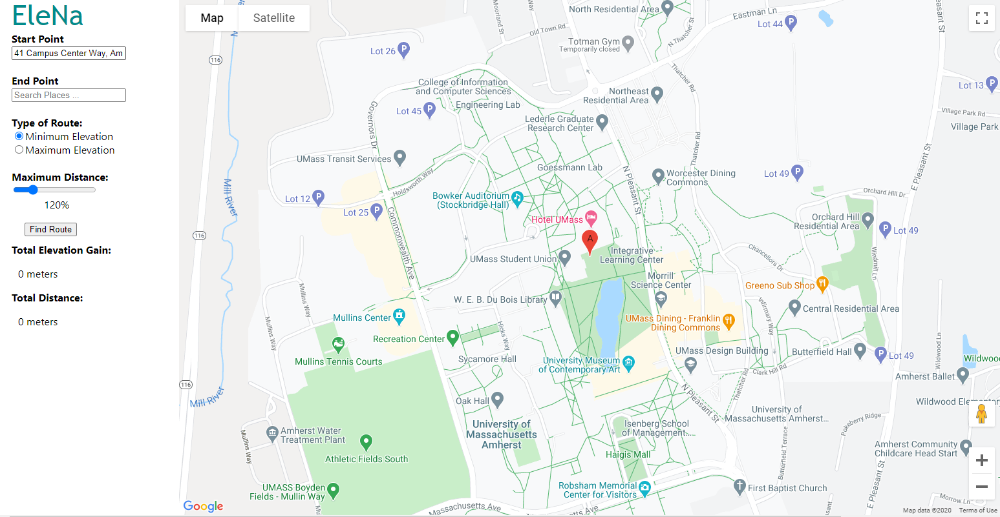
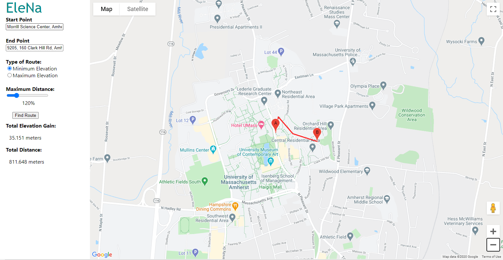

# EleNA: Elevation Based Navigation

## What is EleNA?
EleNa (Elevation-based Navigation) is a web application that finds the optimal route between two points by considering distance and elevation gain. EleNa would be used by runners, bikers, and hikers.

## How to run the App

### 1. Install front-end dependencies and the server dependencies

    Inside the /react-googlemaps directory run:
    
        npm install

    Inside /backend directory run:
        
        pip install -r requirements.txt

### 2. In the **/react-googlemaps** directory, run the React client using the following command:

`npm start`

### In the the **/backend** directory, run the Flask server using the following command:

`python server.py`

## How to use the App

### 1. Enter start and end points. You can do this either by:

    Entering an address in the text boxes to the left
    
    Interacting with the map, left click will add starting marker, right click will add ending marker (markers are draggable)

### 2. Select whether you want for minimize or maximize elevation by selecting one of the radio buttons

### 3. Use the slider to select a maxiumum distance threshold based on percentage

### 4. Press the submit button, and a route and it's information will be displayed!
        

## How to run Tests

### 1. In the */react-googlemaps* directory run:

`npm test` 

### 2. In the the */backend* directory run:

`python -m unittest discover -v -s ./tests -p "*_test.py"` 
