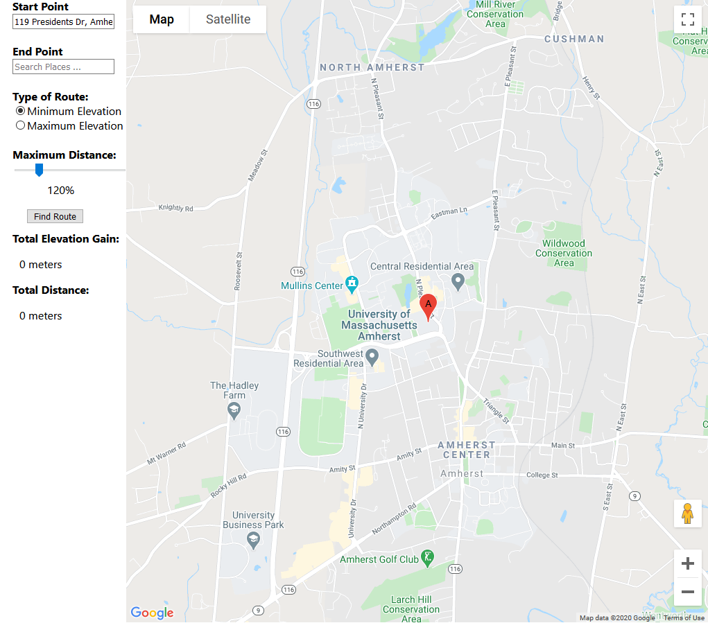
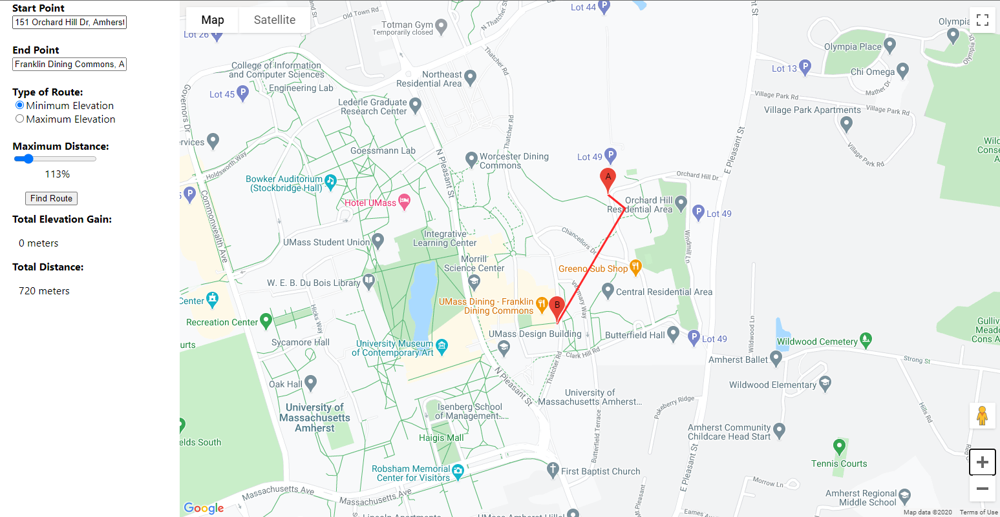

# EleNA: Elevation Based Navigation

## What is EleNA?
EleNa (Elevation-based Navigation) is a web application that finds the an optimal route between two points by considering distance and elevation gain. EleNa would be used by runners, bikers, and hikers.

## How to run the App

### 1. Install front-end dependencies and the server dependencies using the following two commands:

    Inside the /react-googlemaps directory `npm install`

    Inside /backend directory `pip install -r requirements.txt`

### 2. In the **react-googlemaps** directory, run the React client using the following command:

`npm start`

### In the the **backend** directory, run the Flask server using the following command:

`python server.py`

## How to run Tests

### 1. In the */react-googlemaps* directory run:

`npm test` 

### 2. In the the */backend* directory run:

`python -m unittest discover -v -s ./tests -p "*_test.py"` 